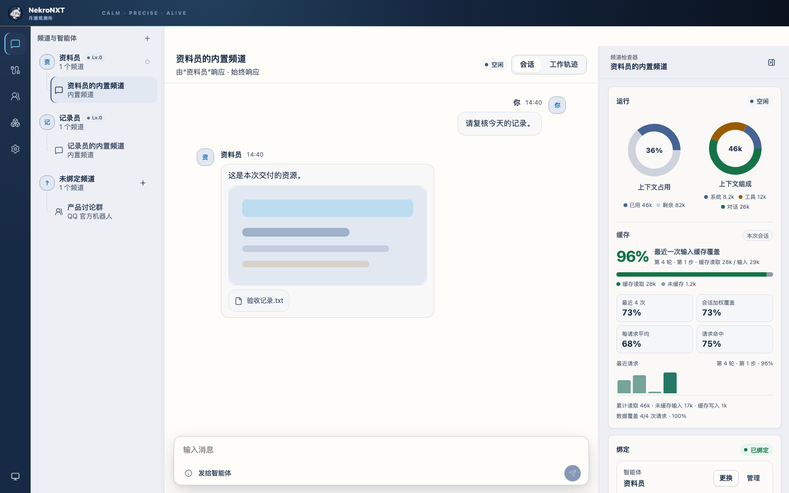

<p align="center"><a href="README.md">简体中文</a> · <a href="docs/README.md">Documentation</a> · <a href="https://github.com/NekroAI/nekro-nxt/releases/tag/preview">Download Preview</a></p>

NekroNXT is a group-chat agent system by NekroAI. Adapters connect it to messaging platforms. Agents can follow multi-person conversations, use tools, and keep a separate context for every channel.

## Built for group chats

Adapters handle account login, message delivery, and channel discovery. Adding a platform keeps the same account, channel, and agent workflow.

Each group chat has its own message history and runtime context. Mentions and trigger rules can wake an agent. Messages that arrive during tool use are recorded and passed into the next reasoning step.

DSH runs the reasoning loop, tools, persistent sessions, context compaction, model providers, and extensions. NekroNXT handles messaging connections, channel management, delivery records, and the product UI.

Agents remain manageable over time, with separate personas, models, permissions, channels, and extensions. The built-in creator can run, inspect, revise, save, and enable local extensions.

## Product preview



Screenshots are provided for interface reference only.

## Get started

The desktop app includes the complete local runtime. Choose the package for your platform:

| Platform | Client download                                                                        |
| -------- | -------------------------------------------------------------------------------------- |
| macOS    | [Download NekroNXT Preview](https://github.com/NekroAI/nekro-nxt/releases/tag/preview) |
| Windows  | [Download NekroNXT Preview](https://github.com/NekroAI/nekro-nxt/releases/tag/preview) |
| Linux    | [Download NekroNXT Preview](https://github.com/NekroAI/nekro-nxt/releases/tag/preview) |

For a long-running server, replace the two placeholders and run:

```bash
docker run -d \
  --name nekro-nxt \
  --restart unless-stopped \
  -p 127.0.0.1:4960:4960 \
  -e NEKRO_MANAGEMENT_KEY='<management-key-at-least-32-characters>' \
  -v '<persistent-data-directory>:/data' \
  ghcr.io/nekroai/nekro-nxt:preview
```

The complete user documentation is currently maintained in Chinese: [Quick start](docs/guide/getting-started.md), [Desktop installation](docs/guide/desktop.md), [Server deployment](docs/guide/server.md), [Connect messaging channels](docs/guide/connections.md), and [Troubleshooting](docs/guide/troubleshooting.md).

NekroNXT is an early preview. The main user flow works today, while adapters, recovery coverage, and distribution are still being expanded.

The software license will be added by the project owner before public release. Brand and character assets are separately reserved; see [Brand guidelines](docs/BRAND.md) and [`NOTICE`](NOTICE).

Copyright © 2026 NekroAI contributors.
