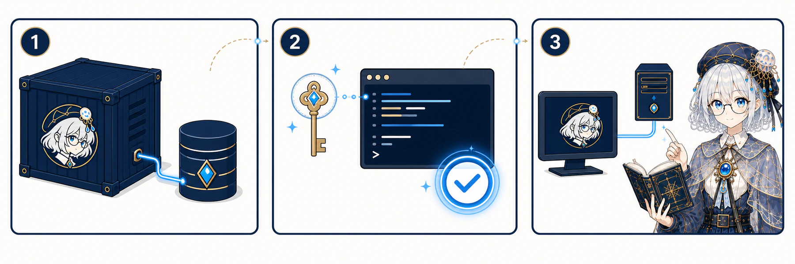

<p align="center">
  
</p>

<h1 align="center">NekroNXT</h1>

<p align="center"><strong>让智能体进入真实群聊，也参与创造自己的扩展。</strong></p>

<p align="center">
  以 DSH 为核心引擎 · 原生频道隔离 · Desktop / Server 双宿主 · 动态扩展
</p>

<p align="center">
  简体中文 · <a href="README.en.md">English summary</a> · <a href="docs/README.md">用户文档</a>
</p>


> [!IMPORTANT]
> NekroNXT 目前处于早期预览阶段。核心 MVP 流程已经成形，但安装包尚未签名，升级恢复和平台连接仍在持续验证；请先使用测试数据体验。

## NekroNXT 是什么

NekroNXT 是 NekroAI 开发的高扩展智能体聊天系统。你可以创建具有独立人设、模型和能力的智能体，把内置频道或外部平台频道交给它响应，并让获得授权的智能体生成、试跑和保存本地扩展。

- **以智能体为长期实体**：人设、模型、授权能力、频道和扩展都围绕同一个可管理对象组织；
- **频道事实彼此隔离**：每个频道拥有自己的消息事实流和会话上下文，不把不同群聊直接混在一起；
- **真实工具与投递证据**：智能体通过通信工具发言，模型原始输出不会自动冒充已发送消息；
- **动态创造闭环**：描述需求、运行动态包、查看验证证据、保存为本地扩展，再明确选择使用它的智能体；
- **同一产品，两种宿主**：Desktop 面向安装即用，Server 面向 7×24 小时运行，两者复用核心、数据模型、Web UI 和扩展体系。

## 产品画面


更多真实产品截图：[智能体工作台](assets/brand/screenshots/agent-workbench.png) · [平台连接](assets/brand/screenshots/connections.png) · [创造工作台](assets/brand/screenshots/creator-workbench.png)

截图使用虚构智能体、频道和消息；具体平台名称来自已安装的适配器。

## 安装与部署

### Desktop：适合个人电脑

Desktop 安装包自带 Server 与 Web UI，运行时不要求预装 Node、pnpm、Python 或 Docker。


1. 从 [Preview Release](https://github.com/NekroAI/nekro-nxt/releases/tag/preview) 下载对应平台的安装包和 `receipt.json`；
2. 安装 macOS Universal DMG、Windows x64 NSIS 或 Linux x64 AppImage；
3. 打开 NekroNXT，在「设置」中配置模型供应商，再创建第一个智能体。

当前安装包尚未签名。系统安全提示、Stable/Preview 并装和数据目录说明见[Desktop 安装指南](docs/guide/desktop.md)。

### Server：适合长期运行

Server 使用一个容器和一个主要 `/data`，并通过管理密钥、自动 TLS 与设备配对保护管理界面。



```bash
git clone https://github.com/NekroAI/nekro-nxt.git
cd nekro-nxt
NEKRO_MANAGEMENT_KEY='请替换为至少32个字符的随机字符串' docker compose up --build -d
```

默认只绑定 `127.0.0.1:4960`。开放远程访问、保存 `/data` 和配对 Desktop 前，请阅读 [Server 部署指南](docs/guide/server.md)。

## 十分钟完成首次使用

1. 在「设置 → 模型供应商」保存 API Key，并完成连接测试；
2. 在「工作」中新建智能体，填写名称、人设并选择模型；
3. 创建完成后打开自动生成的内置频道，发送第一条消息；
4. 需要群聊接入时，在「连接」选择已安装的适配器并添加账号；
5. 发现频道后绑定智能体与触发方式；
6. 需要新能力时，为智能体开启创造权限，在创造工作台运行并保存本地扩展。

完整步骤见[快速开始](docs/guide/getting-started.md)。

## 文档

| 我想做什么           | 入口                                                                                   |
| -------------------- | -------------------------------------------------------------------------------------- |
| 安装并开始第一次对话 | [快速开始](docs/guide/getting-started.md)                                              |
| 安装 Desktop         | [Desktop 安装](docs/guide/desktop.md)                                                  |
| 部署长期运行的服务   | [Server 部署](docs/guide/server.md)                                                    |
| 配置模型和 API Key   | [配置模型](docs/guide/models.md)                                                       |
| 创建智能体、连接频道 | [创建智能体](docs/guide/agents.md) · [连接频道](docs/guide/connections.md)             |
| 使用动态创造与扩展   | [使用扩展](docs/guide/extensions.md)                                                   |
| 升级、备份或排障     | [升级与备份](docs/guide/upgrade-backup.md) · [常见问题](docs/guide/troubleshooting.md) |
| 了解架构或参与开发   | [贡献者入口](docs/guide/contributors.md)                                               |

## 项目状态

- Stable 与 Preview 使用独立安装身份和数据目录，可以并装；
- `main` 通过完整 CI 后生成滚动 Preview；正式 Stable Release 由版本 Tag 触发；
- macOS 目标为 Universal DMG，Windows 与 Linux 当前目标为 x64；
- 代码签名、公证、整包自动替换和社区扩展市场尚未开放；
- 当前一期进度和已知缺口见[一期开发计划](docs/04-一期开发计划与决策清单.md)。

## 从源码运行

源码开发需要 Node.js `^22.19.0 || >=24.0.0` 和 pnpm `11.7.0`：

```bash
pnpm install --frozen-lockfile
pnpm dev
```

提交前运行：

```bash
pnpm check
pnpm test
pnpm build
pnpm test:journey
```

工程约束、包职责和验证要求从 [`AGENTS.md`](AGENTS.md) 与[贡献者入口](docs/guide/contributors.md)进入。

## 参与、支持与安全

- 提交代码或文档前阅读 [`CONTRIBUTING.md`](CONTRIBUTING.md)；
- Bug 与功能建议使用 [GitHub Issues](https://github.com/NekroAI/nekro-nxt/issues)；
- 使用问题和支持边界见 [`SUPPORT.md`](SUPPORT.md)；
- 安全漏洞请按 [`SECURITY.md`](SECURITY.md) 使用 GitHub 私密漏洞报告，不要创建公开 Issue；
- 社区交流遵循 [`CODE_OF_CONDUCT.md`](CODE_OF_CONDUCT.md)。

## 许可证与品牌

项目所有者将在仓库公开前补充代码许可证；当前不存在隐含的软件授权。NekroNXT、NXT、水月荧、Logo、安装器图形和宣传素材不属于代码许可证，详见 [`BRAND.md`](BRAND.md) 与 [`NOTICE`](NOTICE)。

Copyright © 2026 NekroAI contributors.
