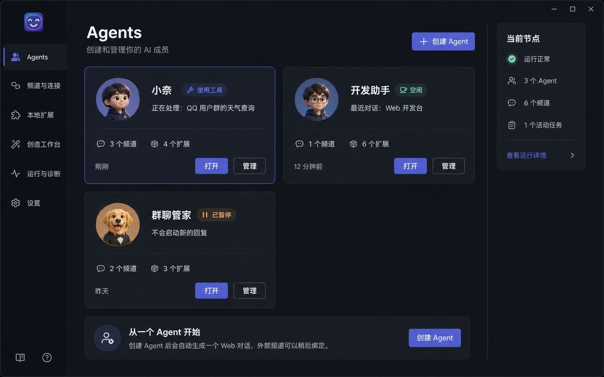
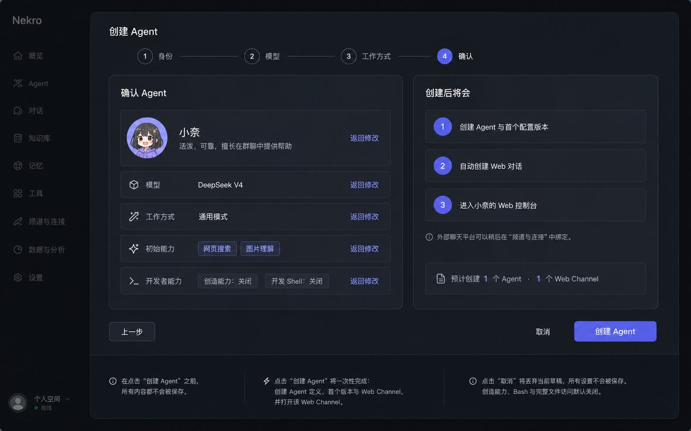
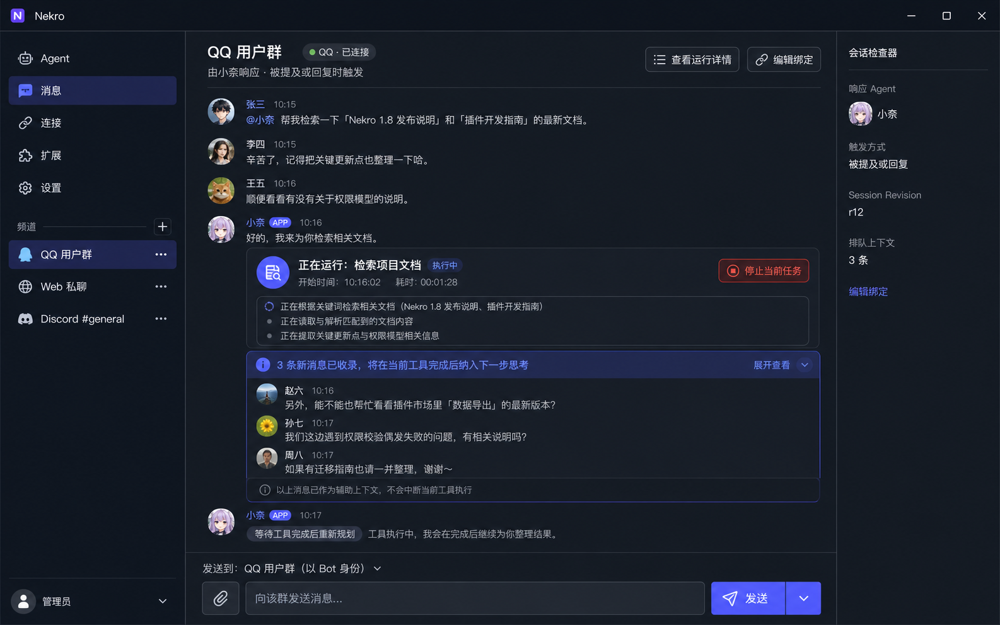
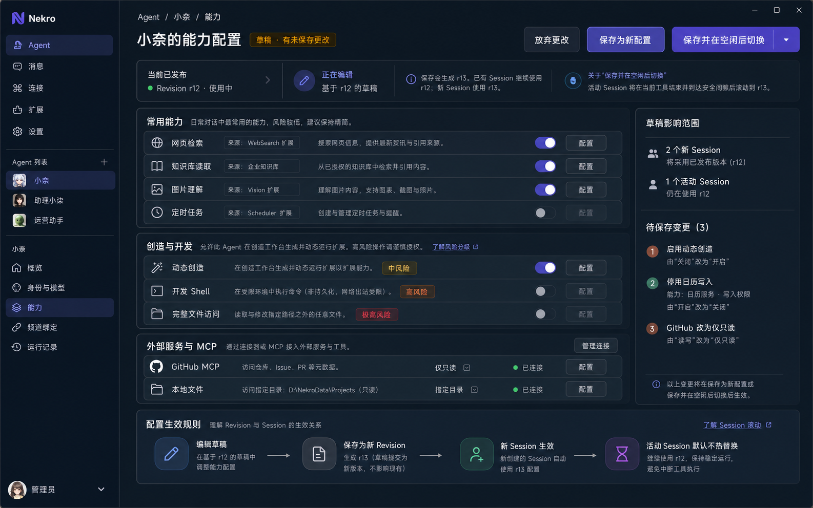
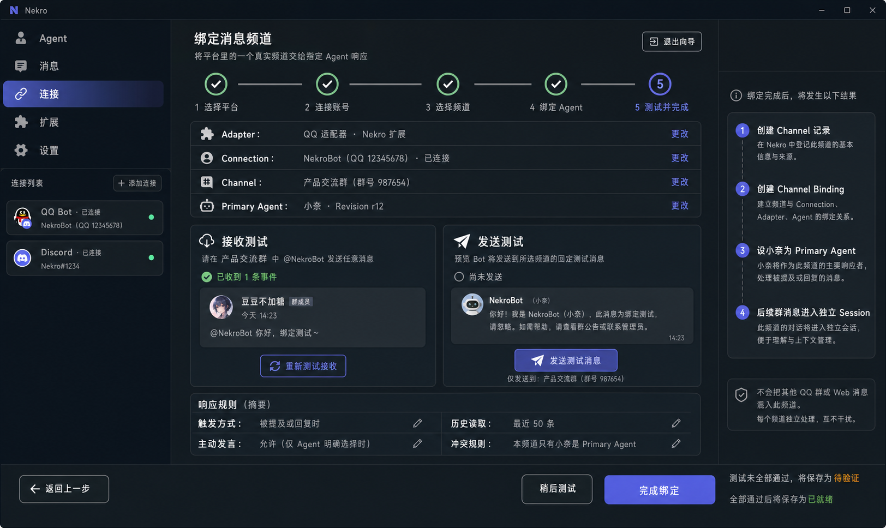
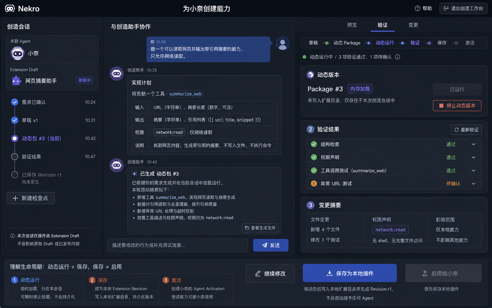
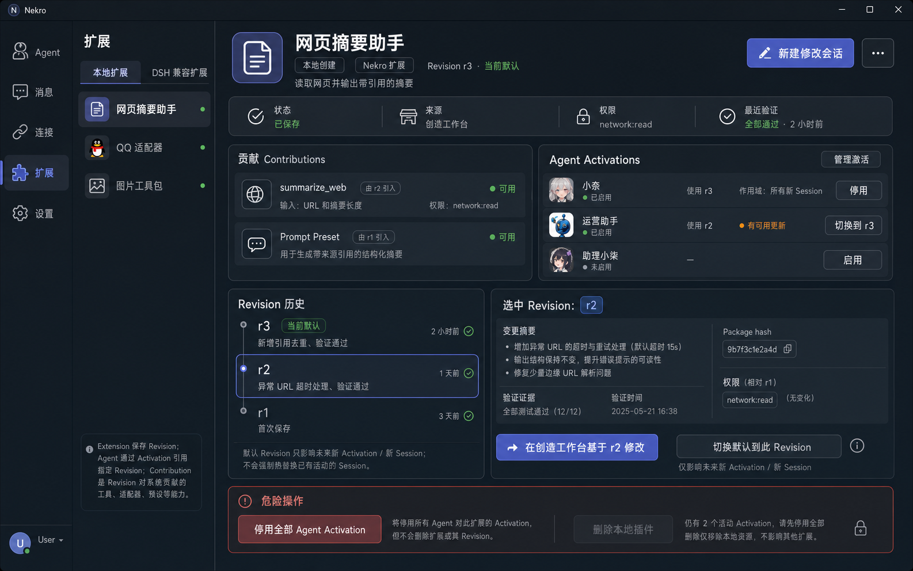

# NekroNxt 产品形态与用户旅程

> 状态：V2 产品交互基线  
> 更新日期：2026-08-15  
> 依据：`NekroNxt完整设计方案.md`、`NekroNxt项目共识.md`、`NekroNxt界面交互模型.md`  
> 图像性质：用于冻结对象关系、页面职责和操作后果；视觉样式仍可迭代

> 文案铁律：用户界面只称“智能体”。内部 `AgentDefinition` 等类型仅用于实现说明，不是产品文案。

## 1. 产品究竟是什么

NekroNxt 不是传统机器人后台，也不是把 IDE 包进聊天窗口。它是一个以智能体为长期实体、以 Channel 为对话事实边界、以 Extension 为能力单位的桌面与 Web 应用。

```text
创建和管理智能体
       ↓
把平台中的真实 Channel 绑定给智能体
       ↓
智能体在独立 Channel Session 中对话和使用工具
       ↓
用户可让已启用创造能力的智能体生成、试跑和验证 Extension
       ↓
保存 Extension Revision，并按智能体独立激活
```

首版主产品有两种宿主形态：

- Desktop：Windows/macOS 安装即用，适合个人首次体验与本地创造；
- Server：单容器、单主要数据目录，适合 7×24 小时运行；
- 两者复用同一套 TypeScript 核心、数据模型、Web UI 和 Extension 机制；
- 首版不做 Desktop 与 Server 实例之间的自动数据迁移。

## 2. 页面背后的核心对象

| 对象 | 用户心智 | 不应混淆为 |
|---|---|---|
|智能体| 一个持续存在、有人设和能力的 AI 个体 | 某个 QQ 群或一次模型请求 |
| `AgentRevision` |智能体配置的一次不可变发布 | 直接覆盖运行中 Session 的热配置 |
| Connection | 一个已登录的平台账号连接 | 平台中的某个群聊 |
| Channel | Web 会话、QQ群、Discord 频道等消息事实流 |智能体本身 |
| Channel Binding | 哪个智能体以何种规则响应某个 Channel | Adapter 或登录账号 |
| Session |智能体在一个 Channel 中连续工作的上下文 | 跨所有平台混合的聊天记录 |
| Extension | 可贡献工具、适配器、预设或 UI Slot 的能力包 | 只能提供 Tool 的狭义插件 |
| Extension Revision | Extension 的不可变保存版本 | 动态试运行产生的临时 Package |
| `AgentActivation` | 某智能体使用某 Extension Revision 的关系 | 安装插件后自动全局生效 |

所有页面都必须有且只有一个主要对象。右侧检查器只展示摘要和就地动作，完整编辑进入对应管理页。

## 3. 全局导航与状态语言

首版全局导航建议保持为：

```text
智能体
消息
连接
扩展
设置
```

创造工作台由智能体或 Extension 的明确动作进入，不必长期占据一级导航。运行详情作为消息或智能体的上下文页面进入。

避免使用一个“在线”绿点概括所有状态：

- Node：正常、启动中、需要重启、恢复模式、离线；
- Connection：已连接、连接中、认证过期、已断开、异常；
-智能体：空闲、思考中、使用工具、等待输入、已暂停、不可用；
- Binding：监听中、暂停响应、连接断开、配置错误；
- Extension：草稿、动态运行中、本地已保存、已加载、已停止、加载失败；
- Activation：未激活、已激活、等待安全切换、激活失败、已停用。

## 4. 七个核心界面

### 4.1智能体首页：先知道“我有哪些智能体”



页面主对象是智能体Collection，不承担聊天。它回答三个问题：有哪些智能体、它们现在在做什么、我从哪里继续。

每张智能体卡只展示身份、运行状态、Channel 数、当前任务、最后活动和本地扩展数量。“使用工具”“空闲”“已暂停”描述的是智能体Runtime，不代表 Connection 或 Node 状态。

| 操作 | 前提 | 结果 |
|---|---|---|
| 创建智能体| 用户可管理当前实例 | 打开智能体Draft 向导 |
| 打开 |智能体已存在 | 打开最近使用的 Channel；没有时创建 Web Channel |
| 管理 |智能体已存在 | 打开智能体管理页，不进入聊天 |
| 暂停响应 |智能体有监听中的 Binding | 阻止启动新 Turn，不取消当前 Tool |

### 4.2 创建智能体：最少信息、原子落库



向导只有“身份 → 模型 → 工作方式 → 确认”四步。创建前所有输入都属于智能体Draft，不留下半创建对象。

点击“创建智能体”后原子产生：

1. `AgentDefinition`；
2. 首个 `AgentRevision`；
3. 一个可以立即使用的 Web Channel；
4. Web Channel 到该智能体的默认 Binding。

子智能体默认开启；网页搜索只在 Provider 与凭据就绪时默认开启；文件工具、动态创造、开发 Shell 和不受限文件访问默认关闭。外部 QQ/Discord Channel 以后再绑定，不把首次上手变成部署向导。

### 4.3 单 Channel 会话：消息事实流不能混流



页面标题必须是当前 Channel“QQ 用户群”，副标题才说明“由小奈响应”。中央只出现该群的消息；Web 私聊和 Discord 只存在于左侧独立入口。

工具执行期间到达的新群消息先可靠收录为辅助上下文：

```text
3 条新消息已收录
→ 当前工具继续运行
→ 到达安全间隙
→ 聚合并注入下一步思考
→智能体可重新规划下一个 Tool 或回复
```

| 操作 | 真实后果 |
|---|---|
| 展开查看 | 展开待注入消息，不改变运行状态 |
| 停止当前任务 | 产生控制事件，取消当前模型或 Tool；已收录消息仍保留 |
| 查看运行详情 | 查看本 Turn 的步骤、Tool 和排队上下文 |
| 编辑绑定 | 修改此 Channel 的响应智能体和触发规则 |
| 发送 | 通过标题所示平台的机器人账号发送到 Channel |

普通聊天消息永远不隐式等于停止。Composer 不放“能力”“创造状态”等脱离发送语境的按钮。

### 4.4智能体能力配置：发布新 Revision，而非覆盖现场



页面主对象是“基于 r12 的配置草稿”。子智能体、网页搜索、文件工具、动态创造、开发 Shell、不受限文件访问分别授权；高风险能力只警示、不按频道强制封禁，开启创造不隐式获得 Shell 或宿主文件权限。

| 操作 | 真实后果 |
|---|---|
| 保存为新配置 | 生成 r13；已有 Session 保持 r12 |
| 应用到当前会话 | 生成 r13 并计算兼容性差异；兼容变化在安全间隙应用，不兼容变化才滚动 Session |
| 放弃更改 | 只丢弃当前 Draft，r12 不变 |
| 配置某项能力 | 修改 Draft，不立即改变运行中的智能体|

界面同时展示待保存 diff 与影响范围，让用户在保存前知道“谁会变化、何时变化”。产品不提供“立即替换工具执行中的 Session”。

### 4.5 Channel Binding：把平台能力翻译成五步任务



向导固定为：

```text
选择平台
→ 连接账号
→ 选择真实频道
→ 绑定智能体与触发规则
→ 分别测试接收和发送
```

Adapter 是 Extension 提供的接入贡献；Connection 是登录账号；Channel 是具体群或频道；Binding 才决定智能体如何响应。它们在实现中不同，但不要求用户先学习术语才能完成任务。

接收测试和发送测试必须分开，因为平台权限可能单向成功。测试未完成时，“稍后测试”或“完成绑定”保存为“待验证”；两项通过后才显示“已就绪”。完成绑定不修改智能体人设、模型或能力。

### 4.6 创造工作台：动态运行、保存、激活严格分离



页面主对象是 Extension Draft“网页摘要”，目标智能体“小奈”同时是对话、动态运行与激活上下文。普通用户通过对话向已启用创造能力的小奈描述需求，结构化界面展示计划、权限、变更和验证证据。系统不会为创造过程另建一个“创造助手”智能体。

```text
需求与 Draft
→ 生成动态 Package
→ 仅在当前创造会话动态运行
→ 执行结构、权限和真实调用验证
→ 保存为本地 Extension Revision
→ 用户再决定是否创建 `AgentActivation`
```

| 操作 | 真实后果 |
|---|---|
| 动态运行 | 内存加载临时 Package，仅对当前创造会话可见 |
| 停止动态版本 | Dispose 当前动态 Run，保留 Draft 与检查点 |
| 继续修改 | 以当前 Package 为基线生成下一个 Package |
| 保存为本地扩展 | 写入本地扩展目录并生成不可变源码 Revision，不自动构建为持久事实，也不自动授权智能体|
| 启用给小奈 | 仅保存后可用；创建小奈的 `AgentActivation` |

验证结果必须来自真实检查和执行，可展开查看输入、输出与错误。首版不伪造社区认证、签名、SBOM 或审核状态。

### 4.7 本地扩展详情：统一体系、按智能体独立激活



所有 Extension 都在同一目录和生命周期中管理。`NekroNxt 扩展`、`Adapter`、`DSH 兼容`是贡献类型或兼容性标签，不构成互相割裂的插件系统。

页面同时呈现：

- Contributions：工具、Adapter、Preset、UI Slot 等实际贡献；
- Revision：不可变的扩展版本和验证证据；
- `AgentActivation`：哪个智能体正在使用哪个 Revision；
- 危险操作：停用范围和删除前提。

“新建修改会话”会创建新 Draft 并进入创造工作台，不直接改写 r3。切换默认 Revision 只影响未来 Activation；各智能体仍可固定在不同 Revision。只要存在活动 Activation，“删除本地扩展”就不可执行，并明确说明前置条件。

## 5. 跨页面完整状态流

### 5.1智能体配置流

```text
`AgentDefinition` r12
→ 编辑 Draft
→ 发布 r13
→ 未来 Activation 默认引用 r13
→ 活动 Session 保持 r12；用户要求应用时先判断兼容性，必要时在安全间隙滚动到 r13
```

### 5.2 Extension 创造流

```text
Extension Draft
→ Dynamic Package #n
→ Dynamic Run
→ Validation Evidence
→ Local Extension Revision
→ `AgentActivation`
```

这些状态不可合并：试跑成功不等于保存，保存不等于启用，安装或更新 Extension 不等于强制替换活动 Session。

### 5.3 群消息投递流

```text
Adapter 收到平台事件
→ Connection 验证身份
→ 写入唯一 Channel Log
→ Binding 判断是否触发智能体
→ 创建或继续该 Channel Session
→ Tool 执行期间的新消息进入 Pending Context
→ 安全间隙注入并重新规划
```

智能体需要对频道发言时，必须调用统一通信工具；Web 与外部平台没有两套回复规则。文字、Mention、图片和文件均由工具结构化发送，模型原始输出只在后台运行详情中观察，不直接进入频道消息流。

不同 Channel 的短期消息事实不混合；跨 Channel 共享长期记忆必须通过显式记忆能力，而不是拼接聊天记录。

## 6. 真实用户路径

### 6.1 第一次使用

**需求：** 安装后尽快获得一个能聊天的 AI 伙伴。  
**理想行为：** 只配置身份与模型，系统创建 Web Channel 并直接可聊。  
**交互：** 创建智能体→ 填名称和一句人设 → 配模型 → 选择通用工作方式 → 创建 → 打开 Web Channel。

### 6.2 接入一个 QQ 群

**需求：** 让现有“小奈”在指定群中被提及时回应。  
**理想行为：** QQ Adapter、账号、群和智能体逐层选择，收发分别验证。  
**交互：** 连接 → 添加连接 → 选择已安装平台（例如 QQ）→ 填写平台账号 → 选择群 → 选择智能体 → 设置触发规则 → 测试接收/发送 → 完成绑定。

### 6.3 群成员在 Tool 执行中补充条件

**需求：**智能体尽快利用新信息，但不要浪费已经执行的工作。  
**理想行为：** 新消息立即入库并显示为排队上下文，Tool 完成后智能体重新规划。  
**交互：** 群成员正常发言即可；管理员可展开待注入消息，只有确需取消时才点击“停止当前任务”。

### 6.4 让智能体创造一个网页摘要能力

**需求：** 不会 TypeScript 的用户也能生产一个可用 Tool。  
**理想行为：** AI 先明确输入输出和权限，生成动态包，真实调用验证，用户体验后再保存和启用。  
**交互：** 管理小奈 → 开启动态创造 → 进入创造工作台 → 描述需求 → 查看计划与权限 → 动态运行 → 补充测试/要求修改 → 保存为本地扩展 → 启用给小奈。

### 6.5 插件新版本不符合预期

**需求：** 回退某个智能体，而不影响其他智能体。  
**理想行为：** Revision 不可变，各 Activation 独立指向版本。  
**交互：** 扩展 → 选择 Revision → 查看验证证据 → 对目标智能体切换 Revision；活动 Session 在安全间隙生效。

### 6.6 7×24 小时运行

**需求：** 在 VPS/NAS 长期运行并轻松升级。  
**理想行为：** 使用单容器和一个主要 `/data`；Web UI 复用上述全部界面。升级前备份数据，替换镜像后执行兼容迁移和健康检查。  
**交互：** 挂载 `/data` → 配置必要环境项 → 启动容器 → Web 创建智能体与 Connection → 后续拉取新镜像升级。

### 6.7 高级开发者路径

**需求：** 用 TypeScript、DSH/Cordis API 深入开发复杂 Adapter 或 Extension。  
**理想行为：** CLI 与 UI 使用同一 Extension/Revision/Activation 模型，源码开发不是另一套发布体系。  
**交互：** 从扩展详情打开源码或用 CLI 创建 → 编写与测试 → 加载为新 Revision → 在指定智能体/Channel 验证。

## 7. 交互实现铁律

1. 页面标题必须指出当前主要对象；
2. 一个 Channel 只展示自己的消息事实流；
3. 普通消息不取消 Tool，只有明确控制动作可以停止任务；
4.智能体与 Extension 都通过不可变 Revision 演进；
5. 活动 Session 不在 Tool 执行中热替换配置或扩展；
6. 动态运行、保存 Revision、创建 Activation 是三个动作；
7. Adapter 与功能能力使用同一 Extension 体系，差异通过 Contribution 表达；
8. 按钮必须说明对象和后果，不用“确定”“查看”“能力”替代真实动作；
9. 灰色按钮必须解释缺少什么前提；
10. 对话负责表达意图，结构化 UI 负责状态、范围、证据和确认。

## 8. 图像版本说明

本轮七张 V2 概念图由内置 imagegen 生成，提示词以 `NekroNxt界面交互模型.md` 为约束，逐页限定主要对象、按钮结果和状态变化。图中头像、示例名称、时间和具体视觉风格属于占位；页面职责、对象边界、状态推进和主操作代表当前产品基线。

旧版两张概念图已移至 `../assets/product-concepts/archive-v1/`，仅供比较，不再作为实现依据。图中若出现 Agent 等旧称，均视为过期文案。
