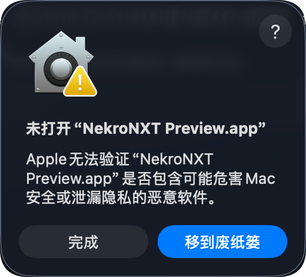
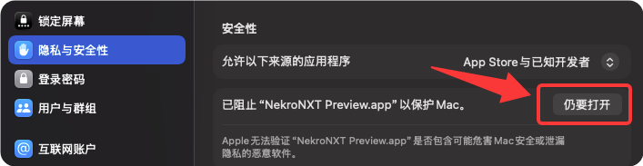
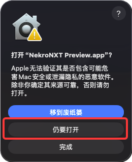

# 桌面版安装

NekroNXT 桌面版（Desktop）把界面与完整运行环境放进一个安装包，日常使用不要求预装 Node.js、pnpm、Python 或 Docker。

## 下载渠道

- **稳定版（Stable）**：从[最新正式版](https://github.com/NekroAI/nekro-nxt/releases/latest)下载，固定 Tag 和安装包不会被后续版本覆盖；
- **预览版（Preview）**：`main` 完整 CI 通过后更新的滚动构建，适合提前验证下一版改动。

发布流程会核对每个安装包的版本、Release ID、commit、文件大小和 SHA-256；GitHub 资产列表显示安装包的 SHA-256。

## 平台

### macOS

下载与芯片匹配的 DMG：Apple Silicon Mac 选择文件名含 `-mac-arm64-` 的包，Intel Mac 选择含 `-mac-x64-` 的包。打开 DMG，将 NekroNXT 拖入“应用程序”，然后从“应用程序”中启动。

macOS 安装包已经过完整性校验，但尚未使用 Apple Developer ID 签名和公证。首次打开时需要手动确认；下面的操作只适用于从 [NekroAI 官方 Release](https://github.com/NekroAI/nekro-nxt/releases)下载的安装包。截图使用 Preview，正式版中的应用名称是 `NekroNXT.app`。

#### 首次打开被系统拦截

1. 第一次启动时，如果看到“未打开 NekroNXT.app”或“未打开 NekroNXT Preview.app”，点击“完成”，不要点击“移到废纸篓”。

   

2. 打开“系统设置 → 隐私与安全性”，向下找到对应的 NekroNXT 拦截记录，点击右侧的“仍要打开”。这个按钮只有在上一步启动被拦截后才会出现。

   

3. macOS 再次询问时，确认应用名称是 `NekroNXT.app` 或 `NekroNXT Preview.app`，点击“仍要打开”。完成一次确认后，可直接启动当前安装的版本。

   

如果系统仍提示应用“已损坏”，或者“隐私与安全性”中始终没有“仍要打开”，请删除旧应用和旧 DMG，再从官方 Release 下载最新版本。

### Windows

下载 x64 `setup.exe`。安装向导允许选择当前用户安装目录，卸载默认保留产品数据。

### Linux

下载 x64 AppImage，赋予执行权限后运行：

```bash
chmod +x nekro-nxt-*.AppImage
./nekro-nxt-*.AppImage
```

## 稳定版与预览版

两条通道使用不同 appId、安装身份、快捷方式和数据目录，可以并装。Preview 图标右下角带黄铜—流明蓝—黄铜三节点标记；不要把两个通道的数据目录互相覆盖。

升级同一通道时安装新的安装包。应用展示名是 `NekroNXT`，现有 `NekroNxt` 数据目录和可执行文件标识沿用原名，升级后会找到原来的数据。

## 数据与远程实例

桌面版的本地实例数据位于 Electron `userData/data/`。窗口还可以保存多个远程服务端；每个实例拥有独立设备凭据和浏览器存储。切换实例只改变当前管理界面，其他实例中的智能体照常运行。

备份和恢复见[升级、备份与恢复](upgrade-backup.md)。
