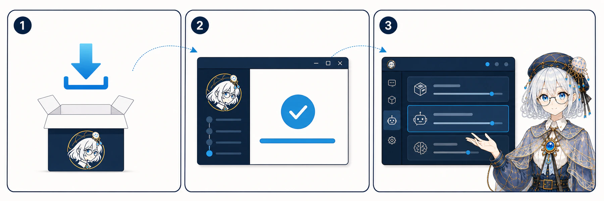

# Desktop 安装

NekroNXT Desktop 将同版本 Server、Web UI 和运行时打进一个安装包，日常使用不要求预装开发工具。



## 下载渠道

- **Preview**：`main` 完整 CI 通过后更新的滚动预览版；
- **Stable**：由不可移动版本 Tag 发布，当前尚未提供公开稳定版。

每个平台安装包旁都有 `receipt.json`，其中包含版本、Release ID、commit 和 SHA-256。当前包未签名，校验 receipt 后再安装。

## 平台

### macOS

下载 Universal DMG，打开后将 NekroNXT 拖入 Applications。未签名阶段，系统可能要求在“隐私与安全性”中确认首次打开。

### Windows

下载 x64 `setup.exe`。安装向导允许选择当前用户安装目录，卸载默认保留产品数据。

### Linux

下载 x64 AppImage，赋予执行权限后运行：

```bash
chmod +x nekro-nxt-*.AppImage
./nekro-nxt-*.AppImage
```

## Stable 与 Preview

两条通道使用不同 appId、安装身份、快捷方式和数据目录，可以并装。Preview 图标右下角带黄铜—流明蓝—黄铜三节点标记；不要把两个通道的数据目录互相覆盖。

升级同一通道时安装新完整包。应用展示名已经统一为 `NekroNXT`，但既有 `NekroNxt` 数据目录和可执行文件标识保持不变，避免升级后创建空白数据根。

## 数据与远程实例

Desktop 的本地实例数据位于 Electron `userData/data/`。窗口还可以保存多个远程 Server；每个实例拥有独立设备凭据和浏览器存储，切换界面不会停止其他实例中的智能体。

备份和恢复见[升级、备份与恢复](upgrade-backup.md)。
