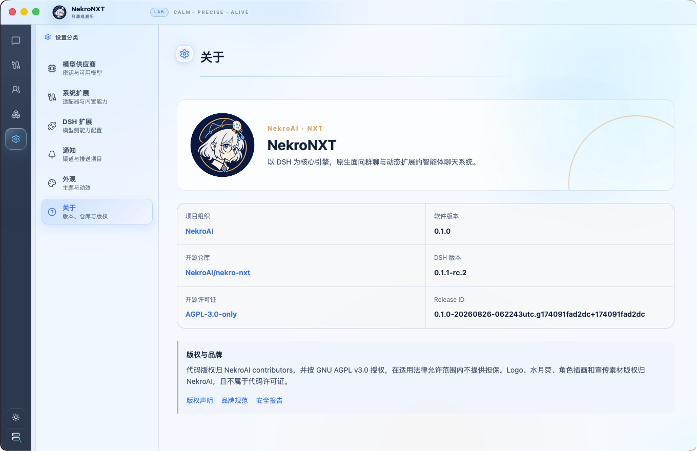

# ✨ 本次更新

NekroNXT 将 DeepSeek Harness 接入即时通讯，为多人群聊提供可持续运行、可调用工具、可按需扩展的智能体验。

## 🚀 核心特性

- **面向多人群聊**：支持提及和触发规则，工具运行期间到达的新消息纳入下一步思考；
- **统一接入即时通信平台**：适配器、账号、频道与智能体采用统一连接模型；
- **DSH 智能体运行内核**：提供思考循环、工具执行、会话持久化、上下文压缩、模型接入和扩展运行；
- **长期管理智能体**：分别配置人设、模型、权限、频道和扩展；
- **本地扩展创造**：从需求描述进入运行和验证流程，成果保存为本地扩展后交给指定智能体使用；
- **桌面版与服务端**：桌面版适合个人电脑，服务端适合长期在线和远程管理；
- **多服务实例管理**：桌面客户端支持保存和切换本地及远程 NekroNXT 实例。

