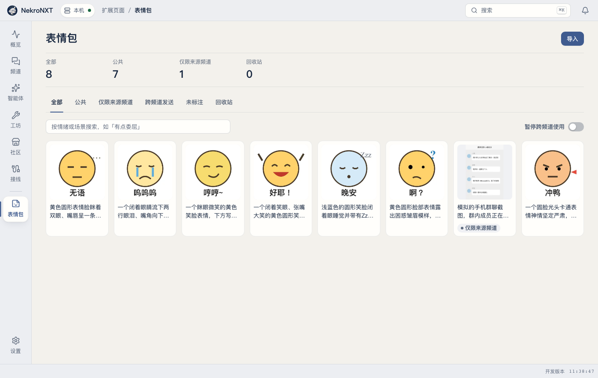

# ✨ 本次更新

本次更新新增官方扩展「Emotion 表情包」：智能体在聊天中收集表情包，按情绪和场合挑一张发出，公共表情包在各个频道共享，以前攒下的表情包可以批量导入。扩展获得了素材库、检索和模型调用等新能力；智能体可以用编排模式一次完成多步操作，命令与文件访问限定在工作区内。

## 🚀 主要变化

- **Emotion 表情包**：在「社区」安装后为智能体启用。智能体收集群聊中的表情包，记下表达的情绪与图中文字；回复时按意思检索，用视觉核对候选图后发送。含有聊天截图、昵称或个人信息的图片仅限来源频道使用。左侧导航的「表情包」页面可以浏览、检索、编辑和批量导入图片或 zip，导入时由所选的视觉模型自动标注。智能体设置中可以调整收集策略与使用频率；
- **语义检索**：「设置 → 检索」可在界面内下载语义模型，下载后扩展的检索按意思匹配，不下载时按关键词检索；
- **扩展能力**：扩展可以把频道中的图片收入自己的素材库并在其他频道使用、建立可检索的索引、在工具结果中附上图片供智能体查看，扩展页面还可以调用「设置 → 模型」中已配置的模型；
- **编排模式（PTC）**：开启「运行命令」后可在智能体能力中开启编排模式，智能体把查询、处理和回复写成一段程序一次完成，适合翻阅大量记录或批量处理文件。设备上没有 Node 时，可在同一位置下载运行环境；
- **连发消息**：智能体可以把一次回复拆成几条消息连续发出，「设置 → 聊天」中可以调整每条之间的间隔；
- **扩展兼容提示**：社区列表与扩展详情会标出需要更新版本 NekroNXT 的扩展，并显示所需版本，此类扩展不能安装。

## 🛠️ 改进与修复

- **命令与文件访问**：「工作区读写」与「运行命令」只能读取智能体自己的工作区；「运行命令」下新增「命令联网」开关，可单独禁止命令访问网络。系统访问刻度支持拖动选择；
- **实时更新**：修复频道聊天记录偶尔停止更新、刷新页面才恢复的问题。连接中断时界面会提示并自动重连，页面从后台回到前台时重新同步；
- **服务端容器**：把宿主机目录挂载到 `/data` 时不再因目录属主不符而无法启动，可用 `NEKRO_UID`、`NEKRO_GID` 指定运行用户；修改 `NEKRO_PORT` 后健康检查随之生效；服务端镜像同时提供 amd64 与 arm64 版本；
- **扩展**：导入扩展后工坊直接选中该扩展；导入新版本时扩展名称与简介随之更新；扩展页面的导航图标支持 SVG；
- **用语**：界面中的「看图」统一改称「视觉」，例如「视觉模型」「支持视觉」。

## ⚠️ 升级前留意

- **工作区以外的文件**：智能体运行的命令与文件工具不再能读取工作区以外的文件。如需访问其他目录，请在智能体能力中开启对应的访问级别；
- **旧版本安装新扩展**：Emotion 表情包等使用新能力的扩展需要本版本才能安装，旧版本在安装时会提示先升级。
