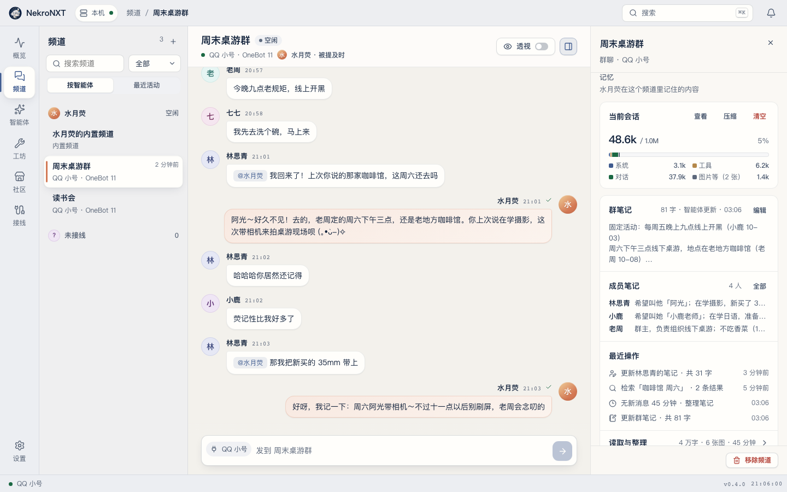

# ✨ 本次更新

本次更新围绕智能体在群聊中的表现展开：新增频道记忆与成员记忆，重写智能体的群聊发言规范，并优化长期未被唤醒频道的响应速度。扩展统一为单一形态，同一扩展可同时提供智能体能力、页面与平台适配；OneBot 11 连接支持文件发送。

## 🚀 主要变化

- **频道记忆**：智能体在每个频道维护两类笔记。群笔记记录群规、固定活动等面向整个频道的信息；成员笔记记录单个成员的称呼偏好、近况与喜好，并在该成员与智能体对话时一并提供，成员数量较多的群聊中也能识别回访成员。被问及历史内容时，智能体会先检索聊天记录、依据原文作答；频道静默一段时间后，智能体会自动整理笔记；
- **「记忆」面板**：频道详情新增「记忆」分组，支持查看和编辑群笔记与成员笔记、锁定笔记、删除指定成员的笔记，并显示智能体最近的检索与记录操作。同一分组可设置未读消息读取上限、未读图片查看上限，以及频道静默多久后自动整理笔记；
- **群聊发言规范**：重写智能体的系统说明。群聊回复更简短，不使用标题与加粗等格式；存在待回复的消息时，智能体不会在未回复的情况下结束本轮处理；
- **频道说明**：支持在频道详情中为智能体设置仅在当前频道生效的要求，例如群规、语气与称呼，不影响其人设；
- **账号识别**：智能体可以区分自身账号与本机其他智能体的账号。同一群聊中的本机智能体默认不互相触发回复，可在频道详情中开启；
- **扩展形态统一**：同一扩展可同时提供智能体能力、页面、平台适配与 MCP 服务，扩展页面可添加到左侧导航栏。社区按扩展提供的能力分类，扩展详情改为评级卡展示，市场支持多种排序方式；
- **OneBot 11 文件发送**：支持在群聊与私聊中发送文件，单个文件上限 64 MB，协议端与 NekroNXT 可部署在不同设备上。扩展新增表情回应、合并转发、群公告、群打卡及群管理等平台操作；
- **工作区文件发送**：智能体在工作区中生成的图片与文件可直接发送至频道，发送前可预览，误建的资源可删除；
- **透视与检查器**：透视列出每轮处理中提交给模型的消息，并标注触发本轮处理的成员；频道详情可查看智能体实际收到的系统说明、工具与模型；
- **版本显示与更新提醒**：界面底部状态栏显示当前版本，检测到新版本时提示并链接至发布页；预览版仅提示新的预览版。可在「设置 → 关于」中手动检查更新或关闭自动检查；
- **服务端镜像**：服务端镜像同步发布至 Docker Hub，可在默认镜像拉取受限时使用，地址见服务端部署说明。

## 🛠️ 改进与修复

- **响应速度**：长期未被唤醒的频道不再一次性提交全部积压消息与图片，同一图片不再在每个处理步骤中重复上传，积压消息和图片较多的频道响应时间明显缩短；
- **回应与戳一戳触发**：仅当成员回应智能体发送的消息或戳一戳智能体账号时触发处理，成员之间的互动仅记录到频道；智能体账号自身的表情回应、戳一戳与撤回操作不再重复触发；
- **时间处理**：智能体接收的消息时间统一附带时区，成员提及的时间按服务端所在时区解析；
- **扩展**：修复编辑扩展配置时未保存内容被后台刷新覆盖的问题；启用或停用扩展不再中断正在进行的对话；扩展的保存记录统一称为「版本」；
- **界面**：修复悬浮连接提示与下方内容重叠的问题；界面说明与错误提示统一为描述对象、操作与结果，内部错误仅记录到日志。

## ⚠️ 升级前留意

- **旧格式扩展**：本次更新调整了扩展格式。升级前安装且未更新的扩展将显示「格式不受支持」，无法启用。官方扩展已完成更新，可在「社区 → 已安装」中更新；自行创建的扩展需由智能体按新格式重新创建；
- **社区兼容性**：社区已切换至新的扩展格式，旧版本 NekroNXT 无法再从社区安装扩展，请升级后使用；
- **服务端时区**：服务端通过 `TZ` 环境变量设置时区，未设置时按 UTC 解析时间，请设置为频道成员实际所在的时区；
- **笔记默认开启**：智能体默认自动维护频道笔记。如需禁止智能体在某个频道记录笔记，可在频道详情的「记忆」分组中锁定笔记。
