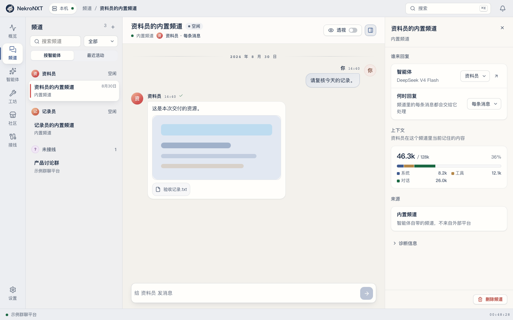

# ✨ 本次更新

本次更新换上了全新的界面，并新增「社区」：可以在 NekroNXT 里直接发现、安装和发布扩展，第一批官方扩展已经上线。扩展可以联网、保存数据、在消息到达时先行处理、按计划唤醒智能体；智能体在对话中就能安排定时任务；工坊可以接入 MCP 服务。服务端现在可以直接用浏览器访问和管理。

## 🚀 主要变化

- **全新界面**：概览、频道、智能体、工坊、接线和设置统一为列表加详情的工作台布局。频道列表可以检索和筛选，详情栏显示智能体、上下文用量和来源；智能体页把模型、频道、能力和定时任务放在一处；接线画布按账号分组展示频道与智能体的绑定。新增命令面板（⌘K / Ctrl+K），可以跳转到任意对象、扩展页面和平台成员，界面密度可在外观中调整；
- **社区**：新的「社区」入口可以浏览和搜索社区扩展，查看审查结论和所需权限后一键安装，安装后仍需在智能体上启用。「已安装」会提醒新发布、作者撤回和下架，并单独列出新版本新增的权限；登录社区账号后，「我的发布」可以把本地扩展发布到社区并查看审查报告。官方维护的扩展标有「官方」，第一批包括掷骰抽签、网页搜索与阅读、图片生成、语音合成、今日运势、节日提醒、RSS 订阅、群管助手和消息守卫；
- **扩展能做更多事**：扩展可以按声明访问网络、读取用户填写的凭据、保存自己的数据、读取当前频道的聊天记录、调用智能体的模型、渲染图片和解析网页与订阅源。启用前会列出这些权限，新版本扩大权限时需要重新批准。创造扩展时可以填写只用于试运行的测试凭据；
- **消息处理与定时唤醒**：扩展可以在消息到达、智能体被唤醒之前先行判断，例如按关键词不唤醒、对智能体隐藏或强制唤醒，频道时间线会标出处理结果；扩展也可以按计划唤醒智能体，订阅类扩展没有新内容时不会打扰智能体；
- **定时任务**：在对话中让智能体「明天早上 8 点提醒我」「每个工作日发一次日报」即可创建，智能体可以查看、修改、暂停和删除。智能体页与频道详情栏会列出所有定时任务，到期提醒在频道中以居中提示显示；
- **MCP 服务**：在工坊中添加远程或本机 MCP 服务，为智能体批准启用后，其中的工具就会出现在智能体的会话里。扩展详情会显示每个服务的连接结果；
- **服务端浏览器访问**：服务端可以直接用浏览器打开，输入管理密钥登录；「设置 → 登录设备」列出已登录的浏览器和桌面版，可以撤销其中任意一台；
- **智能体版本历史**：智能体的人设与模型配置每次保存都会留下版本，可以查看并恢复到之前的版本。删除智能体时可以选择一并删除它的工作区；
- **模型设置**：可以编辑供应商的模型列表、标注支持图片的模型，并恢复默认目录。

## 🛠️ 改进与修复

- **对话**：工具调用以可读摘要显示，可以展开查看完整输入与结果；翻看历史时消息不再被输入框遮住，输入框变高时仍停在最新消息；
- **扩展**：扩展的凭据配置现在可以正确保存，停用或删除扩展后会清理不再使用的凭据；未运行的安装可以直接卸载；删除智能体后，它的创造任务和测试凭据会一并移除；
- **界面**：对话框内容超出窗口时只滚动正文，标题和按钮始终可见；关闭弹出层后焦点回到原来的位置；窄窗口不再出现横向滚动；
- **错误与状态**：适配器未安装等原因停止的连接会显示为需要处理，并说明原因；某个页面加载失败时保留外壳和草稿，可以原地重试。

## ⚠️ 升级前留意

- **升级保留上下文**：升级会先在数据目录的 `backups/` 中创建恢复点。聊天记录、附件、智能体配置、连接、凭据和扩展都会保留，智能体的对话上下文也会继续，不需要重新开始；
- **社区默认连接正式社区**：浏览和安装社区扩展不需要登录，发布扩展和查看自己的审查报告需要在「社区 → 账号」中登录。安装社区扩展前，请阅读扩展的审查结论和权限说明；扩展的服务端代码会以 NekroNXT 的权限运行。
